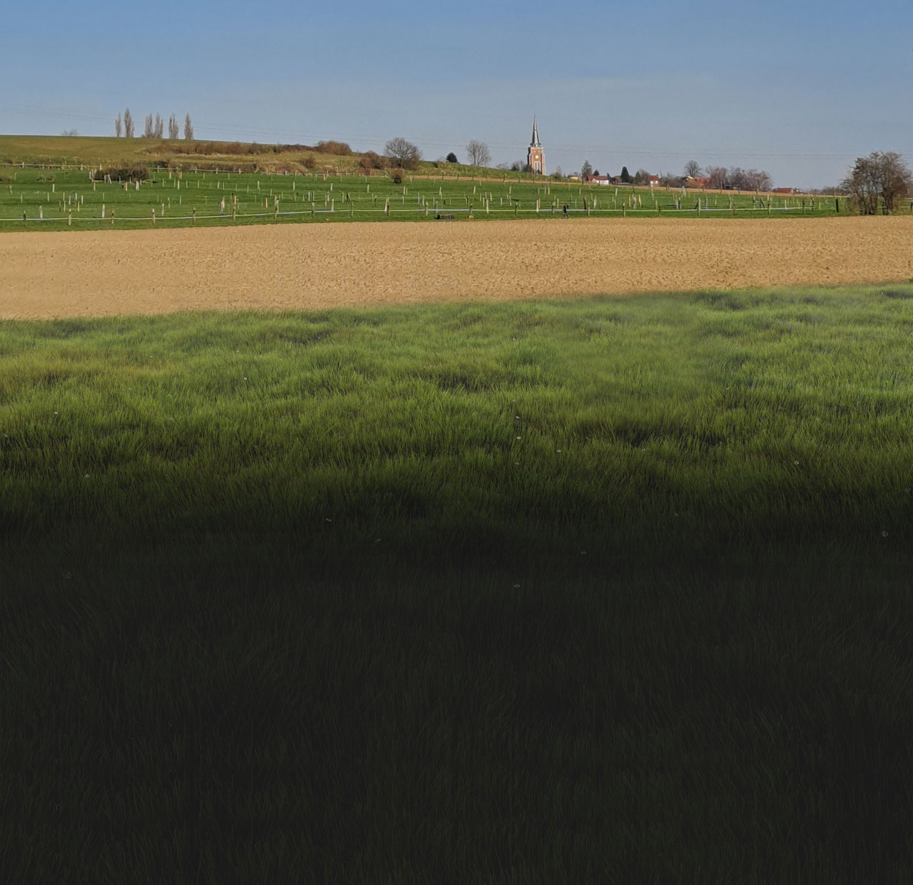

# Beers3000

Pour cet atelier pratique "Beers 3000" vous allez devoir utiliser ce que vous avez appris en SASS mais aussi vos connaissances en HTML et CSS afin de reproduire fidèlement la maquette visible ci-dessus et que vous pourrez télécharger ci-dessous.
L'archive ci-dessous contient également la maquette mobile afin que votre intégration soit responsive.

🔥

Bon courage 😊

[Sommaire](../)

