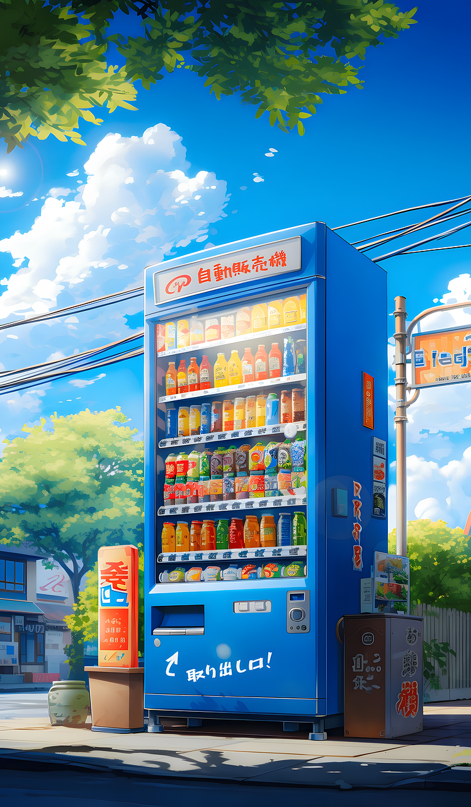

# DistriBoissonsJs

4 boissons : Coca Cola (Prix 0.80€), Fanta (Prix 0.70€), Ice Tea (Prix 0.70€), Perrier (Prix 1€)

 1) L'utilisateur doit saisir la boisson souhaitée
 2) Afficher le prix de la boisson souhaitée
 3) Tester si la somme payée est correcte
 4) Afficher un message « Votre boisson bidule est prête »

ATTENTION LE DISTRIBUTEUR REND LA MONNAIE

Aide : une fonction pour vous faciliter le travail des arrondis sur les prix 🙂

function roundDecimal(nb, precision) {
    var tmp = Math.pow(10, precision);
    return Math.round(nb*tmp)/tmp;
}

[Sommaire](../)