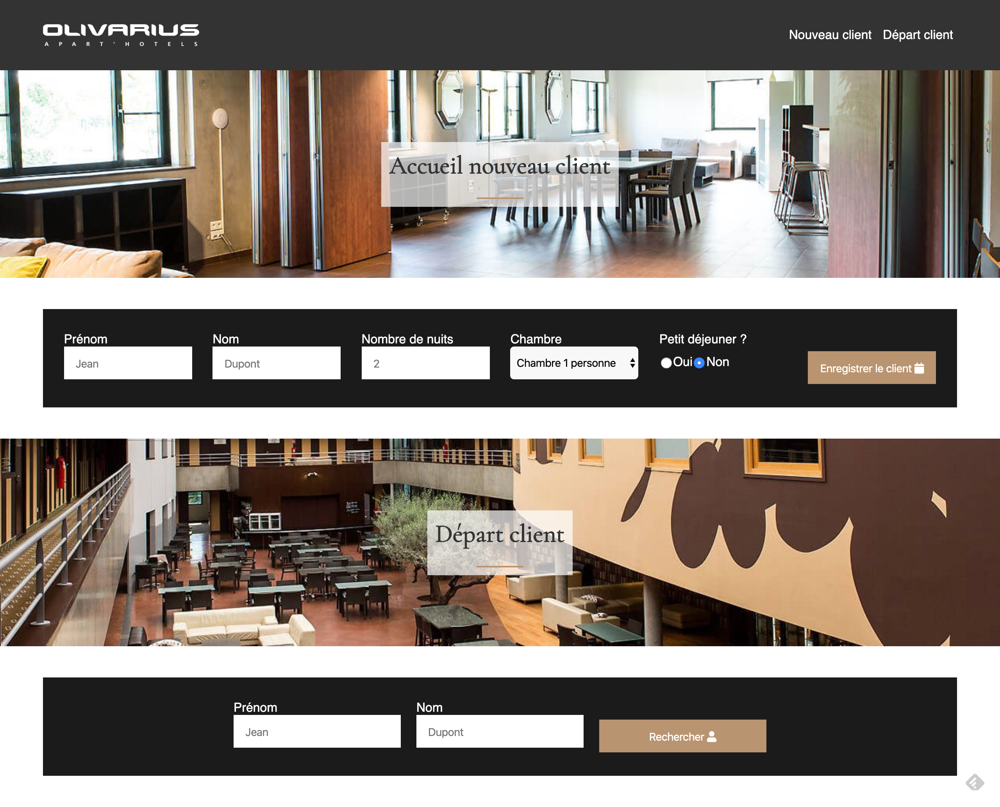

# hotel js

Nous voulons gérer les entrées/sorties des clients à l'accueil de l'hôtel.

Nous disposons de ces informations : 

Arrivée à partir de 15h
Départ avant 11h
Si arrivée prématurée on refuse le client
Si départ après l'heure on majore la facture du client de 10€
Choix du nombre de nuit à l’arrivée
Paiement de la chambre au départ
Option petit déjeuner pendant le séjour (7€/nuit)
Pour simplifier une seule gamme de chambre est disponible au prix de 65€/nuit 

On initialise notre programme avec deux clients déjà présent dans l'hôtel : 

José Garcia : 4 nuits / arrivée avant hier à 16h / pas de petit déjeuner
Antoine de Caunes : 2 nuits / arrivée hier à 18h / option petit déjeuner

😰 BONUS : Trouver une solution, proposée par JavaScript, pour pérenniser le stockage des clients et ne pas perdre les clients lorsqu'on actualise la page. La solution sera donnée dans la revue de code du projet 🙂

Un atelier pratique complet qui vous fera utiliser les dernières notions abordées en JavaScript mais aussi revoir et réutiliser bon nombre de notions vues précédemment ! 🔥

[Sommaire](../)